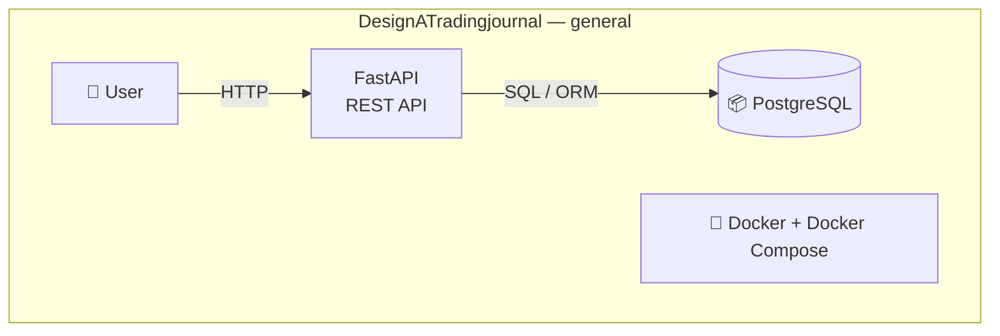
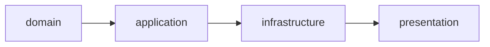

# DesignATradingjournal — System Architecture

```mermaid
graph TB
  subgraph "DesignATradingjournal — general"
    User["👤 User"]
    BE["FastAPI\nREST API"]
    DB[("📦 PostgreSQL")]
    Infra["🐳 Docker + Docker Compose"]
    User -->|HTTP| BE
    BE -->|SQL / ORM| DB
  end
```

## Architecture Pattern: Clean

### Layers

```mermaid
graph LR
  L0["domain"]
  L1["application"]
  L2["infrastructure"]
  L3["presentation"]
  L0 --> L1
  L1 --> L2
  L2 --> L3
```

> Stack: lang=Python | be=FastAPI | db=PostgreSQL | infra=Docker + Docker Compose
