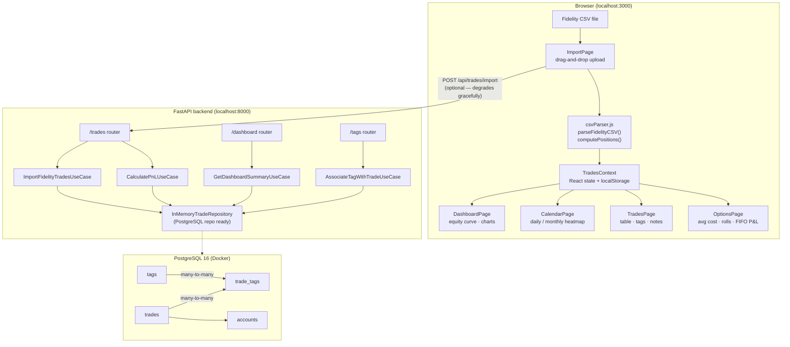

# DesignATradingjournal — System Architecture

```mermaid
graph TB
    subgraph Browser["Browser (localhost:3000)"]
        CSV["Fidelity CSV file"]
        UI_Import["ImportPage\n drag-and-drop upload"]
        UI_Dash["DashboardPage\n equity curve · charts"]
        UI_Cal["CalendarPage\n daily / monthly heatmap"]
        UI_Trades["TradesPage\n table · tags · notes"]
        UI_Opts["OptionsPage\n avg cost · rolls · FIFO P&L"]
        Context["TradesContext\n React state + localStorage"]
        Parser["csvParser.js\n parseFidelityCSV()\n computePositions()"]

        CSV --> UI_Import
        UI_Import --> Parser
        Parser --> Context
        Context --> UI_Dash
        Context --> UI_Cal
        Context --> UI_Trades
        Context --> UI_Opts
    end

    subgraph API["FastAPI backend (localhost:8000)"]
        Router_Trades["/trades router"]
        Router_Tags["/tags router"]
        Router_Dash["/dashboard router"]
        UseCase_Import["ImportFidelityTradesUseCase"]
        UseCase_PnL["CalculatePnLUseCase"]
        UseCase_Dash["GetDashboardSummaryUseCase"]
        UseCase_Tag["AssociateTagWithTradeUseCase"]
        Repo["InMemoryTradeRepository\n (PostgreSQL repo ready)"]

        Router_Trades --> UseCase_Import
        Router_Trades --> UseCase_PnL
        Router_Dash --> UseCase_Dash
        Router_Tags --> UseCase_Tag
        UseCase_Import --> Repo
        UseCase_PnL --> Repo
        UseCase_Dash --> Repo
        UseCase_Tag --> Repo
    end

    subgraph DB["PostgreSQL 16 (Docker)"]
        T["trades"]
        TG["tags"]
        ACC["accounts"]
        TT["trade_tags"]
        T -- many-to-many --> TT
        TG -- many-to-many --> TT
        T --> ACC
    end

    UI_Import -- "POST /api/trades/import\n(optional — degrades gracefully)" --> Router_Trades
    Repo -.-> DB
```
