# DesignATradingjournal — Module Dependencies

```mermaid
graph LR
  _[".\n. module"]
  presentation["presentation\npresentation module"]
  infrastructure_logging["infrastructure.logging\nProvides structured JSON loggi"]
  domain_shared["domain.shared\ndomain.shared module"]
  infrastructure_persistence["infrastructure.persistence\ninfrastructure.persistence mod"]
  domain_trades["domain.trades\ndomain.trades module"]
  domain_tags["domain.tags\ndomain.tags module"]
  domain_accounts["domain.accounts\ndomain.accounts module"]
  domain_imports["domain.imports\ndomain.imports module"]
  domain_dashboard["domain.dashboard\ndomain.dashboard module"]
  _github_workflows[".github.workflows\n.github.workflows module"]
  infrastructure_persistence_models["infrastructure.persistence.models\ninfrastructure.persistence.mod"]
  application_repositories["application.repositories\napplication.repositories modul"]
  application_use_cases["application.use_cases\napplication.use_cases module"]
  infrastructure_persistence_postgres["infrastructure.persistence.postgres\ninfrastructure.persistence.pos"]
  infrastructure_persistence_migrations["infrastructure.persistence.migrations\ninfrastructure.persistence.mig"]
  application_use_cases_imports["application.use_cases.imports\napplication.use_cases.imports "]
  application_use_cases_trades["application.use_cases.trades\napplication.use_cases.trades m"]
  application_use_cases_dashboard["application.use_cases.dashboard\napplication.use_cases.dashboar"]
  application_use_cases_tags["application.use_cases.tags\napplication.use_cases.tags mod"]
  presentation_api_routers["presentation.api.routers\npresentation.api.routers modul"]
  presentation_api["presentation.api\npresentation.api module"]
```

## Module Inventory

| Module | Purpose | Patterns |
|--------|---------|----------|
| `.` | . module |  |
| `presentation` | presentation module |  |
| `infrastructure.logging` | Provides structured JSON logging configuration and a custom JSON formatter. |  |
| `domain.shared` | domain.shared module |  |
| `infrastructure.persistence` | infrastructure.persistence module |  |
| `domain.trades` | domain.trades module |  |
| `domain.tags` | domain.tags module |  |
| `domain.accounts` | domain.accounts module |  |
| `domain.imports` | domain.imports module |  |
| `domain.dashboard` | domain.dashboard module |  |
| `.github.workflows` | .github.workflows module |  |
| `infrastructure.persistence.models` | infrastructure.persistence.models module |  |
| `application.repositories` | application.repositories module |  |
| `application.use_cases` | application.use_cases module |  |
| `infrastructure.persistence.postgres` | infrastructure.persistence.postgres module |  |
| `infrastructure.persistence.migrations` | infrastructure.persistence.migrations module |  |
| `application.use_cases.imports` | application.use_cases.imports module |  |
| `application.use_cases.trades` | application.use_cases.trades module |  |
| `application.use_cases.dashboard` | application.use_cases.dashboard module |  |
| `application.use_cases.tags` | application.use_cases.tags module |  |
| `presentation.api.routers` | presentation.api.routers module |  |
| `presentation.api` | presentation.api module |  |
