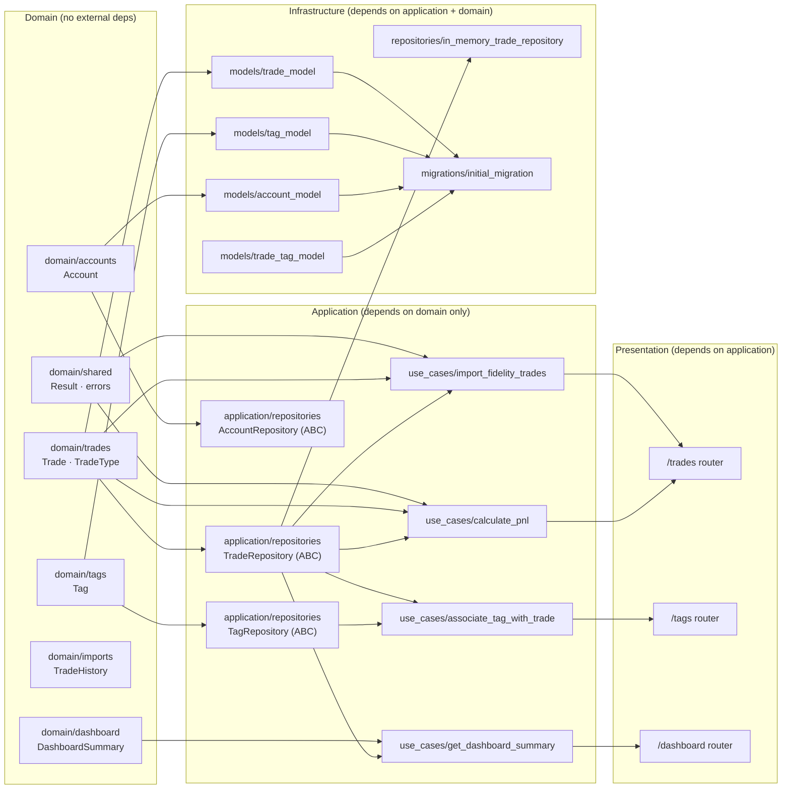

# DesignATradingjournal — Module Dependencies

```mermaid
graph LR
    subgraph Domain["Domain (no external deps)"]
        D_Trade["domain/trades\nTrade · TradeType"]
        D_Tag["domain/tags\nTag"]
        D_Acc["domain/accounts\nAccount"]
        D_Dash["domain/dashboard\nDashboardSummary"]
        D_Imp["domain/imports\nTradeHistory"]
        D_Shared["domain/shared\nResult · errors"]
    end

    subgraph Application["Application (depends on domain only)"]
        A_TradeRepo["application/repositories\nTradeRepository (ABC)"]
        A_TagRepo["application/repositories\nTagRepository (ABC)"]
        A_AccRepo["application/repositories\nAccountRepository (ABC)"]
        UC_Import["use_cases/import_fidelity_trades"]
        UC_PnL["use_cases/calculate_pnl"]
        UC_Dash["use_cases/get_dashboard_summary"]
        UC_Tag["use_cases/associate_tag_with_trade"]
    end

    subgraph Infra["Infrastructure (depends on application + domain)"]
        ORM_Trade["models/trade_model"]
        ORM_Tag["models/tag_model"]
        ORM_Acc["models/account_model"]
        ORM_TT["models/trade_tag_model"]
        Repo_Mem["repositories/in_memory_trade_repository"]
        Migrations["migrations/initial_migration"]
    end

    subgraph Presentation["Presentation (depends on application)"]
        R_Trades["/trades router"]
        R_Tags["/tags router"]
        R_Dash["/dashboard router"]
    end

    D_Trade --> A_TradeRepo
    D_Tag --> A_TagRepo
    D_Acc --> A_AccRepo
    D_Shared --> UC_Import
    D_Shared --> UC_PnL
    D_Trade --> UC_Import
    D_Trade --> UC_PnL
    D_Dash --> UC_Dash
    A_TradeRepo --> UC_Import
    A_TradeRepo --> UC_PnL
    A_TradeRepo --> UC_Dash
    A_TradeRepo --> UC_Tag
    A_TagRepo --> UC_Tag
    D_Trade --> ORM_Trade
    D_Tag --> ORM_Tag
    D_Acc --> ORM_Acc
    A_TradeRepo --> Repo_Mem
    ORM_Trade --> Migrations
    ORM_Tag --> Migrations
    ORM_Acc --> Migrations
    ORM_TT --> Migrations
    UC_Import --> R_Trades
    UC_PnL --> R_Trades
    UC_Dash --> R_Dash
    UC_Tag --> R_Tags
```
