# DesignATradingjournal — Task Execution Plan

Progress: **40/40 tasks** (100% complete)

```mermaid
graph TD
  scaffold_project_structure(["scaffold_project_structure: Create base project directories and…"])
  style scaffold_project_structure fill:#22c55e,color:#fff
  scaffold_docker_infra(["scaffold_docker_infra: Set up `Dockerfile` for FastAPI and…"])
  style scaffold_docker_infra fill:#22c55e,color:#fff
  scaffold_project_structure --> scaffold_docker_infra
  scaffold_fastapi_app(["scaffold_fastapi_app: Create main FastAPI application ins…"])
  style scaffold_fastapi_app fill:#22c55e,color:#fff
  scaffold_project_structure --> scaffold_fastapi_app
  scaffold_logging_config(["scaffold_logging_config: Implement structured logging config…"])
  style scaffold_logging_config fill:#22c55e,color:#fff
  scaffold_project_structure --> scaffold_logging_config
  scaffold_error_handling(["scaffold_error_handling: Define base `Result` type for consi…"])
  style scaffold_error_handling fill:#22c55e,color:#fff
  scaffold_project_structure --> scaffold_error_handling
  scaffold_pytest_setup(["scaffold_pytest_setup: Configure `pytest` for unit and int…"])
  style scaffold_pytest_setup fill:#22c55e,color:#fff
  scaffold_project_structure --> scaffold_pytest_setup
  scaffold_precommit_hooks(["scaffold_precommit_hooks: Add `black`, `isort`, `flake8` to `…"])
  style scaffold_precommit_hooks fill:#22c55e,color:#fff
  scaffold_project_structure --> scaffold_precommit_hooks
  scaffold_db_config(["scaffold_db_config: Define database connection settings…"])
  style scaffold_db_config fill:#22c55e,color:#fff
  scaffold_project_structure --> scaffold_db_config
  define_trade_domain_model(["define_trade_domain_model: Define the `Trade` entity with core…"])
  style define_trade_domain_model fill:#22c55e,color:#fff
  scaffold_project_structure --> define_trade_domain_model
  define_tag_domain_model(["define_tag_domain_model: Define the `Tag` entity for categor…"])
  style define_tag_domain_model fill:#22c55e,color:#fff
  scaffold_project_structure --> define_tag_domain_model
  define_account_domain_model(["define_account_domain_model: Define the `Account` entity for tra…"])
  style define_account_domain_model fill:#22c55e,color:#fff
  scaffold_project_structure --> define_account_domain_model
  define_trade_history_domain_model(["define_trade_history_domain_model: Define `TradeHistory` for raw impor…"])
  style define_trade_history_domain_model fill:#22c55e,color:#fff
  scaffold_project_structure --> define_trade_history_domain_model
  define_dashboard_summary_domain_model(["define_dashboard_summary_domain_model: Define `DashboardSummary` for aggre…"])
  style define_dashboard_summary_domain_model fill:#22c55e,color:#fff
  scaffold_project_structure --> define_dashboard_summary_domain_model
  scaffold_ci_pipeline(["scaffold_ci_pipeline: Create a basic GitHub Actions workf…"])
  style scaffold_ci_pipeline fill:#22c55e,color:#fff
  scaffold_pytest_setup --> scaffold_ci_pipeline
  scaffold_precommit_hooks --> scaffold_ci_pipeline
  scaffold_alembic_setup(["scaffold_alembic_setup: Initialize Alembic for database mig…"])
  style scaffold_alembic_setup fill:#22c55e,color:#fff
  scaffold_db_config --> scaffold_alembic_setup
  scaffold_base_orm_model(["scaffold_base_orm_model: Create a base SQLAlchemy ORM model …"])
  style scaffold_base_orm_model fill:#22c55e,color:#fff
  scaffold_db_config --> scaffold_base_orm_model
  define_trade_repository_interface(["define_trade_repository_interface: Define abstract interface for `Trad…"])
  style define_trade_repository_interface fill:#22c55e,color:#fff
  define_trade_domain_model --> define_trade_repository_interface
  define_calculate_pnl_use_case(["define_calculate_pnl_use_case: Define interface for calculating tr…"])
  style define_calculate_pnl_use_case fill:#22c55e,color:#fff
  define_trade_domain_model --> define_calculate_pnl_use_case
  define_trade_tag_domain_model(["define_trade_tag_domain_model: Define the `TradeTag` association f…"])
  style define_trade_tag_domain_model fill:#22c55e,color:#fff
  define_trade_domain_model --> define_trade_tag_domain_model
  define_tag_domain_model --> define_trade_tag_domain_model
  define_tag_repository_interface(["define_tag_repository_interface: Define abstract interface for `Tag`…"])
  style define_tag_repository_interface fill:#22c55e,color:#fff
  define_tag_domain_model --> define_tag_repository_interface
  define_tag_trade_use_case(["define_tag_trade_use_case: Define interface for associating ta…"])
  style define_tag_trade_use_case fill:#22c55e,color:#fff
  define_trade_domain_model --> define_tag_trade_use_case
  define_tag_domain_model --> define_tag_trade_use_case
  define_account_repository_interface(["define_account_repository_interface: Define abstract interface for `Acco…"])
  style define_account_repository_interface fill:#22c55e,color:#fff
  define_account_domain_model --> define_account_repository_interface
  define_import_trades_use_case(["define_import_trades_use_case: Define interface for importing trad…"])
  style define_import_trades_use_case fill:#22c55e,color:#fff
  define_trade_domain_model --> define_import_trades_use_case
  define_trade_history_domain_model --> define_import_trades_use_case
  define_get_dashboard_summary_use_case(["define_get_dashboard_summary_use_case: Define interface for retrieving das…"])
  style define_get_dashboard_summary_use_case fill:#22c55e,color:#fff
  define_dashboard_summary_domain_model --> define_get_dashboard_summary_use_case
  scaffold_trade_orm_model(["scaffold_trade_orm_model: Create SQLAlchemy ORM model for `Tr…"])
  style scaffold_trade_orm_model fill:#22c55e,color:#fff
  scaffold_base_orm_model --> scaffold_trade_orm_model
  define_trade_domain_model --> scaffold_trade_orm_model
  scaffold_tag_orm_model(["scaffold_tag_orm_model: Create SQLAlchemy ORM model for `Ta…"])
  style scaffold_tag_orm_model fill:#22c55e,color:#fff
  scaffold_base_orm_model --> scaffold_tag_orm_model
  define_tag_domain_model --> scaffold_tag_orm_model
  scaffold_account_orm_model(["scaffold_account_orm_model: Create SQLAlchemy ORM model for `Ac…"])
  style scaffold_account_orm_model fill:#22c55e,color:#fff
  scaffold_base_orm_model --> scaffold_account_orm_model
  define_account_domain_model --> scaffold_account_orm_model
  scaffold_trade_tag_orm_model(["scaffold_trade_tag_orm_model: Create SQLAlchemy ORM model for `Tr…"])
  style scaffold_trade_tag_orm_model fill:#22c55e,color:#fff
  scaffold_base_orm_model --> scaffold_trade_tag_orm_model
  define_trade_tag_domain_model --> scaffold_trade_tag_orm_model
  implement_postgres_trade_repository(["implement_postgres_trade_repository: Implement `TradeRepository` using S…"])
  style implement_postgres_trade_repository fill:#22c55e,color:#fff
  define_trade_repository_interface --> implement_postgres_trade_repository
  scaffold_trade_orm_model --> implement_postgres_trade_repository
  implement_postgres_tag_repository(["implement_postgres_tag_repository: Implement `TagRepository` using SQL…"])
  style implement_postgres_tag_repository fill:#22c55e,color:#fff
  define_tag_repository_interface --> implement_postgres_tag_repository
  scaffold_tag_orm_model --> implement_postgres_tag_repository
  implement_postgres_account_repository(["implement_postgres_account_repository: Implement `AccountRepository` using…"])
  style implement_postgres_account_repository fill:#22c55e,color:#fff
  define_account_repository_interface --> implement_postgres_account_repository
  scaffold_account_orm_model --> implement_postgres_account_repository
  scaffold_initial_migration(["scaffold_initial_migration: Generate and apply the first Alembi…"])
  style scaffold_initial_migration fill:#22c55e,color:#fff
  scaffold_alembic_setup --> scaffold_initial_migration
  scaffold_trade_orm_model --> scaffold_initial_migration
  scaffold_tag_orm_model --> scaffold_initial_migration
  scaffold_account_orm_model --> scaffold_initial_migration
  scaffold_trade_tag_orm_model --> scaffold_initial_migration
  implement_import_trades_use_case(["implement_import_trades_use_case: Implement basic CSV import logic fo…"])
  style implement_import_trades_use_case fill:#22c55e,color:#fff
  define_import_trades_use_case --> implement_import_trades_use_case
  implement_postgres_trade_repository --> implement_import_trades_use_case
  implement_calculate_pnl_use_case(["implement_calculate_pnl_use_case: Implement basic PnL calculation for…"])
  style implement_calculate_pnl_use_case fill:#22c55e,color:#fff
  define_calculate_pnl_use_case --> implement_calculate_pnl_use_case
  implement_postgres_trade_repository --> implement_calculate_pnl_use_case
  implement_get_dashboard_summary_use_case(["implement_get_dashboard_summary_use_case: Implement basic dashboard aggregati…"])
  style implement_get_dashboard_summary_use_case fill:#22c55e,color:#fff
  define_get_dashboard_summary_use_case --> implement_get_dashboard_summary_use_case
  implement_postgres_trade_repository --> implement_get_dashboard_summary_use_case
  implement_tag_trade_use_case(["implement_tag_trade_use_case: Implement logic to tag a trade with…"])
  style implement_tag_trade_use_case fill:#22c55e,color:#fff
  define_tag_trade_use_case --> implement_tag_trade_use_case
  implement_postgres_trade_repository --> implement_tag_trade_use_case
  implement_postgres_tag_repository --> implement_tag_trade_use_case
  scaffold_trades_api_router(["scaffold_trades_api_router: Create FastAPI router for trade ope…"])
  style scaffold_trades_api_router fill:#22c55e,color:#fff
  scaffold_fastapi_app --> scaffold_trades_api_router
  implement_import_trades_use_case --> scaffold_trades_api_router
  implement_calculate_pnl_use_case --> scaffold_trades_api_router
  scaffold_dashboard_api_router(["scaffold_dashboard_api_router: Create FastAPI router for dashboard…"])
  style scaffold_dashboard_api_router fill:#22c55e,color:#fff
  scaffold_fastapi_app --> scaffold_dashboard_api_router
  implement_get_dashboard_summary_use_case --> scaffold_dashboard_api_router
  scaffold_tags_api_router(["scaffold_tags_api_router: Create FastAPI router for tag opera…"])
  style scaffold_tags_api_router fill:#22c55e,color:#fff
  scaffold_fastapi_app --> scaffold_tags_api_router
  implement_tag_trade_use_case --> scaffold_tags_api_router
  register_api_routers(["register_api_routers: Register all API routers with the m…"])
  style register_api_routers fill:#22c55e,color:#fff
  scaffold_fastapi_app --> register_api_routers
  scaffold_trades_api_router --> register_api_routers
  scaffold_tags_api_router --> register_api_routers
  scaffold_dashboard_api_router --> register_api_routers
```

| Status | Count |
|--------|-------|
| ✅ Completed | 40 |
| 🔄 In Progress | 0 |
| ⏳ Pending | 0 |
| ❌ Failed | 0 |
