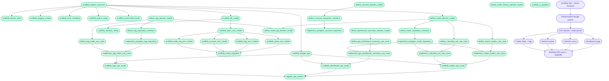

# DesignATradingjournal — Task Execution Plan

Progress: **48/48 tasks** (100% complete) — 40 backend + 8 frontend

```mermaid
flowchart TD
    classDef done fill:#d1fae5,stroke:#10b981,color:#065f46
    classDef fe fill:#ede9fe,stroke:#6c63ff,color:#3730a3

    %% ── Scaffold ──────────────────────────────────────────
    T01([scaffold_project_structure]):::done
    T02([scaffold_docker_infra]):::done
    T03([scaffold_fastapi_app]):::done
    T04([scaffold_logging_config]):::done
    T05([scaffold_error_handling]):::done
    T06([scaffold_pytest_setup]):::done
    T07([scaffold_precommit_hooks]):::done
    T08([scaffold_db_config]):::done

    %% ── Domain ────────────────────────────────────────────
    T09([define_trade_domain_model]):::done
    T10([define_tag_domain_model]):::done
    T11([define_account_domain_model]):::done
    T12([define_trade_history_domain_model]):::done
    T13([define_dashboard_summary_domain_model]):::done
    T14([scaffold_ci_pipeline]):::done
    T15([scaffold_alembic_setup]):::done
    T16([scaffold_base_orm_model]):::done

    %% ── Interfaces ────────────────────────────────────────
    T17([define_trade_repository_interface]):::done
    T18([define_calculate_pnl_use_case]):::done
    T19([define_trade_tag_domain_model]):::done
    T20([define_tag_repository_interface]):::done
    T21([define_tag_trade_use_case]):::done
    T22([define_account_repository_interface]):::done
    T23([define_import_trades_use_case]):::done
    T24([define_get_dashboard_summary_use_case]):::done

    %% ── ORM models ────────────────────────────────────────
    T25([scaffold_trade_orm_model]):::done
    T26([scaffold_tag_orm_model]):::done
    T27([scaffold_account_orm_model]):::done
    T28([scaffold_trade_tag_orm_model]):::done

    %% ── Repos ─────────────────────────────────────────────
    T29([implement_postgres_trade_repository]):::done
    T30([implement_postgres_tag_repository]):::done
    T31([implement_postgres_account_repository]):::done
    T32([scaffold_initial_migration]):::done

    %% ── Use cases ─────────────────────────────────────────
    T33([implement_import_trades_use_case]):::done
    T34([implement_calculate_pnl_use_case]):::done
    T35([implement_get_dashboard_summary_use_case]):::done
    T36([implement_tag_trade_use_case]):::done

    %% ── API ───────────────────────────────────────────────
    T37([scaffold_trades_api_router]):::done
    T38([scaffold_dashboard_api_router]):::done
    T39([scaffold_tags_api_router]):::done
    T40([register_api_routers]):::done

    %% ── Frontend ──────────────────────────────────────────
    F01([Scaffold Vite + React frontend]):::fe
    F02([Glassmorphic design system]):::fe
    F03([CSV upload + trade parser]):::fe
    F04([Dashboard page]):::fe
    F05([Calendar views]):::fe
    F06([Options tracker]):::fe
    F07([Trades table + tags]):::fe
    F08([Backend API proxy + Makefile]):::fe

    %% ── Edges ─────────────────────────────────────────────
    T01 --> T02 & T03 & T04 & T05 & T06 & T07 & T08 & T09
    T08 --> T15 & T16
    T09 --> T17 & T18 & T19 & T23
    T10 --> T19 & T20 & T21
    T11 --> T22
    T13 --> T24
    T16 --> T25 & T26 & T27 & T28
    T17 --> T29
    T18 --> T34
    T20 --> T30
    T22 --> T31
    T23 --> T33
    T24 --> T35
    T25 & T26 & T27 & T28 --> T32
    T29 --> T33 & T34 & T35
    T30 --> T36
    T21 --> T36
    T33 --> T37
    T34 --> T37
    T35 --> T38
    T36 --> T39
    T03 --> T37 & T38 & T39
    T37 & T38 & T39 --> T40

    F01 --> F02 --> F03 --> F04 & F05 & F06 & F07
    F04 & F05 & F06 & F07 --> F08
```
