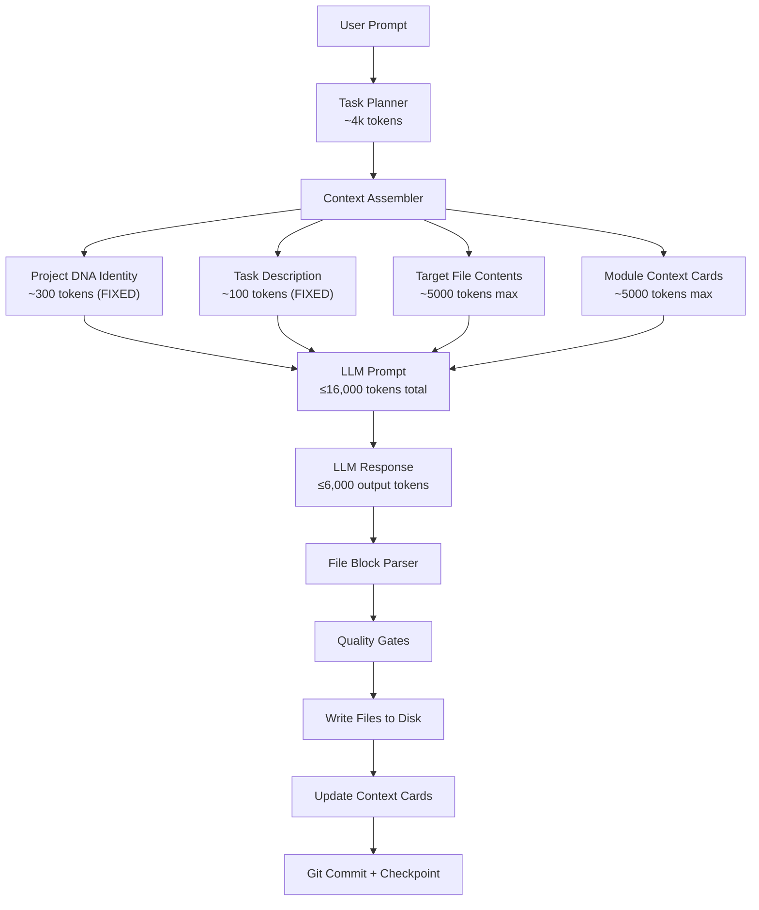

# Token Flow — How CodeDNA Stays Within Budget

## Token Budget: google/gemini/gemini-2.5-flash

| Budget Item | Tokens |
|-------------|--------|
| Context window | 16,000 |
| Output reserve per task | 6,000 |
| Input budget per task | 10,000 |
| DNA identity block | ~300 (never dropped) |
| Task description | ~100 (never dropped) |
| Per module context card | ~200 |
| Max modules in context | ~10 |
